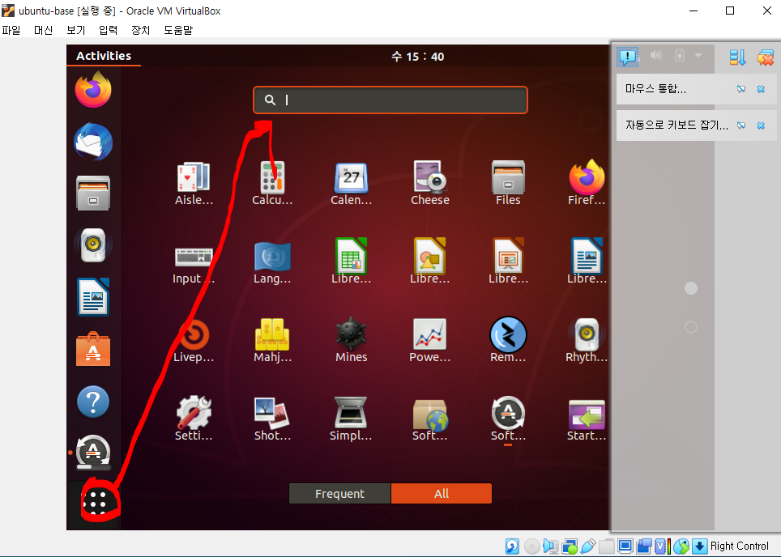
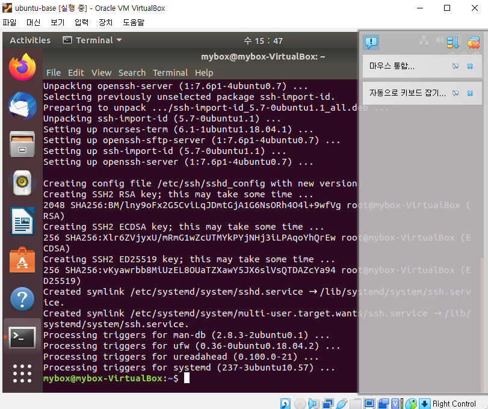
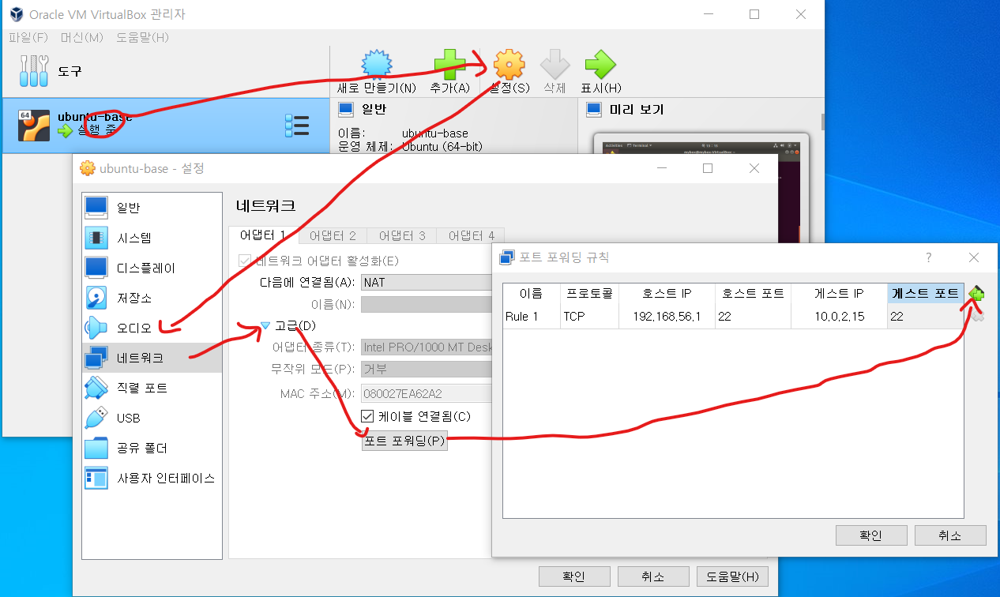

# ssh  통신하기
### 단계1: terminal 조회 및 접속 


---
### 단계2: 필수 라이브러리 설치 
- 필수 라이브러리
  - `vim` : 텍스트 편집기 
  - `wget` : 웹 서버로부터 파일 다운로드
  - `unzip` : 파일 압축/해제
  - `ssh / openssh-*` : 리눅스 원격 접속
  - `net-tools` : 네트워크 툴
```shell
# 업데이트 목록 갱신
sudo apt-get -y update
# 현재 패키지 업그레이드 
sudo apt-get -y upgrade
# 신규 업데이트 설치 
sudo apt-get -y dist-upgrade
# 필수 라이브러리 설치 
sudo apt-get install -y vim wget unzip ssh openssh-* net-tools
```


---
### 단계3: ssh 실행 및 확인 
```shell
# ssh 실행 
sudo service ssh start
# ssh 실행 확인 
systemctl status sshd
```


---
### 단계4: ip확인 
- cmd > host pc
```shell
ipconfig/all
```
- ubuntu > guest pc
```shell
ifconfig
```


---
### 단계5: 포트포워딩 설정 
- 호스트IP: host ip
- 게스트IP: guest ip



---
### 단계6: ubuntu 재기동 


---
### 단계7: config 파일 
- Git Bash를 실행 
- .ssh 생성 
```shell
mkdir ~/.ssh
```
- config 생성 및 작성 
```shell
vim ~/.ssh/config

# 아래 내용 작성 
Host 게스트명 
  HostName 호스트IP
  Port 호스트 port
  User 게스트명
```

---
### 단계8: 게스트pc 접속 및 나오기
- Git Bash를 실행 & ubuntu 접속
```shell
ssh 게스트명
```

- ubuntu 에서 나오기
```shell
exit
```


