# [네트워크의 종류](https://co-no.tistory.com/3)

### NAT 모드 
- 각각의 모든 가상머신들이 별도의 설정이 없다면 동일한 IP 주소(10.0.2.15)를 할당 받는다.
- Host의 네트워크 연결 상태 = Guest의 네트워크 연결 상태. 따라서 포트 포워딩 기법이 필요함 
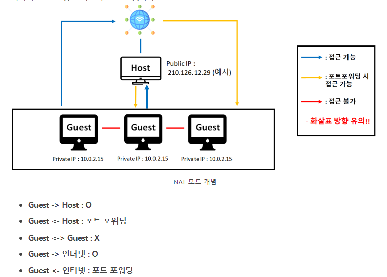

---
## NAT 네트워크 모드
- Host의 네트워크 연결 상태 = Guest의 네트워크 연결 상태
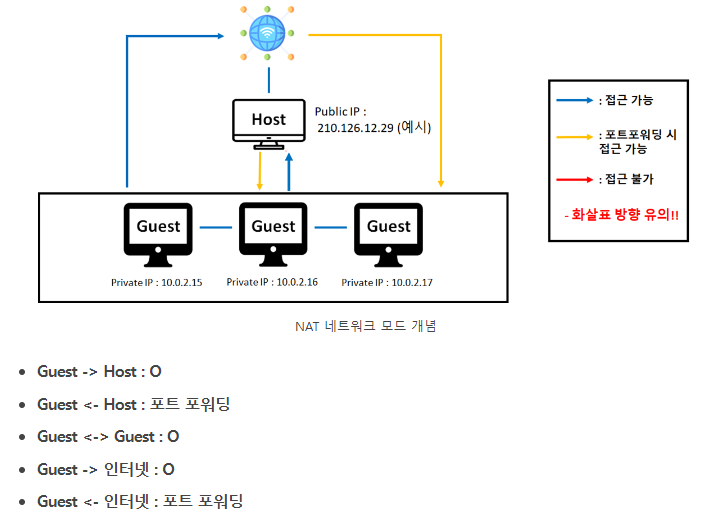

---
## Briedge(브릿지) 모드
- Public IP(공인 IP) 주소를 많이 보유할 수 있을 경우 사용한다.
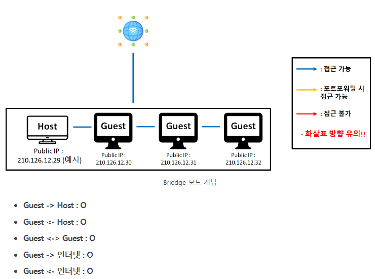

---
### 호스트 전용 어댑터 모드
- Guest의 외부 네트워크와의 접근은 아예 차단되며, Host와 Guest 간의 연결만 허용되는 경우이다. 
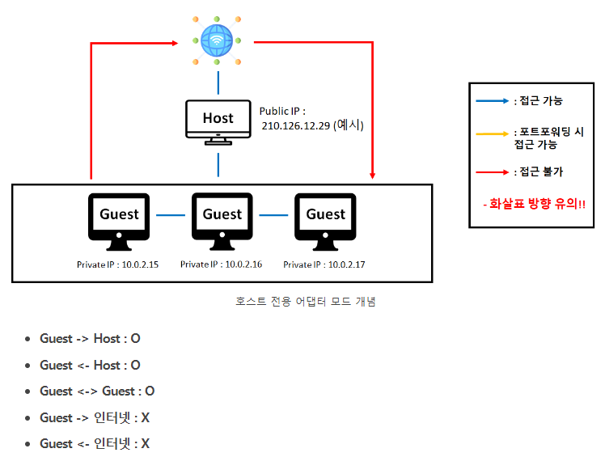

---
### 내부 네트워크 모드
- 호스트 전용 어댑터 모드에서 Host와의 연결조차 끊긴 경우라고 생각하면 된다. 즉, Guest 간의 통신만 가능하다. 
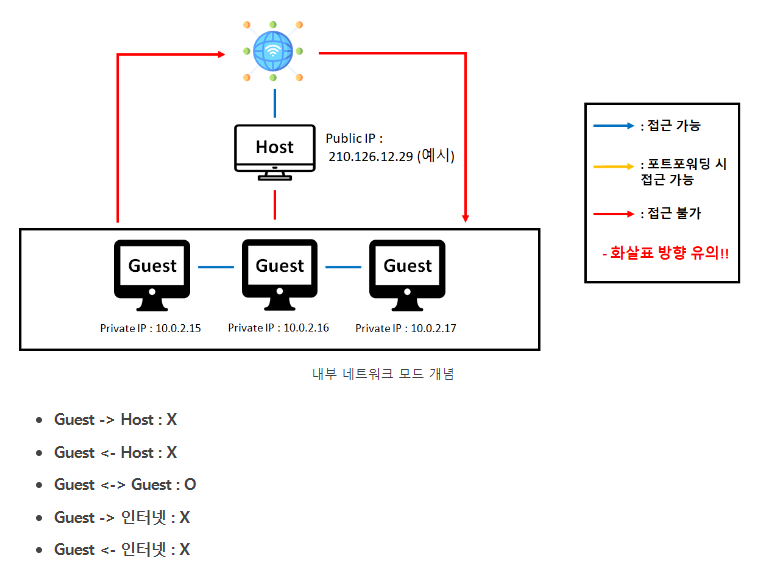

---
# NAT 네트워크 예제 
### 단계0: 3개의 우분투 guest instance 생성하기 
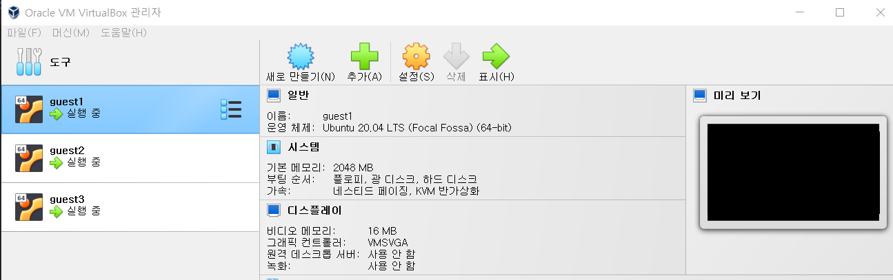

---
### 단계1: 모든 guest > 필수 라이브러리 설치 및 업데이트
- 필수 라이브러리
  - `vim` : 텍스트 편집기 
  - `wget` : 웹 서버로부터 파일 다운로드
  - `unzip` : 파일 압축/해제
  - `ssh / openssh-*` : 리눅스 원격 접속
  - `net-tools` : 네트워크 툴
```shell
# 업데이트 목록 갱신
sudo apt-get -y update
# 현재 패키지 업그레이드 
sudo apt-get -y upgrade
# 신규 업데이트 설치 
sudo apt-get -y dist-upgrade
# 필수 라이브러리 설치 
sudo apt-get install -y vim wget unzip ssh openssh-* net-tools
```

---
### 단계2: 모든 guest > ssh 실행 및 확인 
```shell
# ssh 실행 
sudo service ssh start
# ssh 실행 확인 
systemctl status sshd
```

### 단계3: 모든 guest > hostname 수정 
```shell
# 수정
sudo hostnamectl set-hostname 게스트이름
# 게스트이름 확인 
hostname 
```

---
### 단계4: root 계정 접속 및 비번 생성  
```shell
# root 계정 접속 
sudo su 

# root 비번 생성 
passwd
```

### 단계5: sshd_config 수정 
```shell
vim /etc/ssh/sshd_config

# sshd_config파일에서 아래와 같이 수정 
PermitRootLogin yes # (root 로그인 허용여부를 결정함,yes, no, without-password를 사용할 수 있음) 
PasswordAuthentication yes # (열쇠글 인증을 설정하는 것으로 프로토콜 버전 1과 2 모두 적용) 


# 재실행 
systemctl restart sshd
```

---
### 단계6: host ip 및 모든 guest ip 확인 
- host ip 확인 방법: cmd > ipconfig/all
- guest ip 확인 방법: terminal > ifconfig

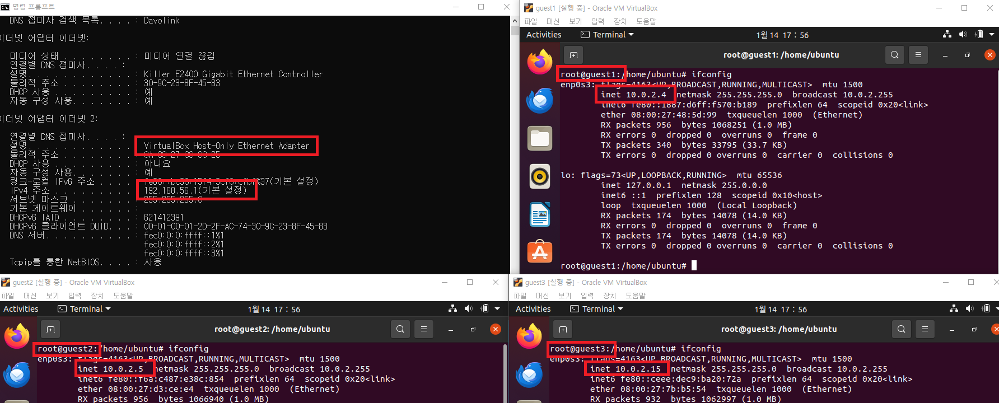

---
### 단계7: VirtualBox의 NAT 네트워크 생성 
1. 도구 > 햄버거 버튼 > 네트워크 > NAT 네트워크 > 포트 포워딩
2. 위에서 확인한 host ip & guest ip를 이미지와 같이 작성 

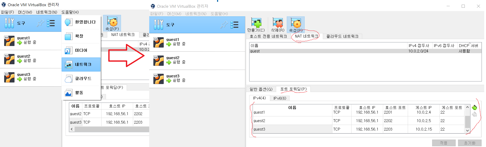


---
### 단계8: 모든 guest의 네트워크 수정 
1. 모든 guest 인스턴스 stop(전원 꺼짐)
2. 위에서 생성한 NAT 네트워크 적용 

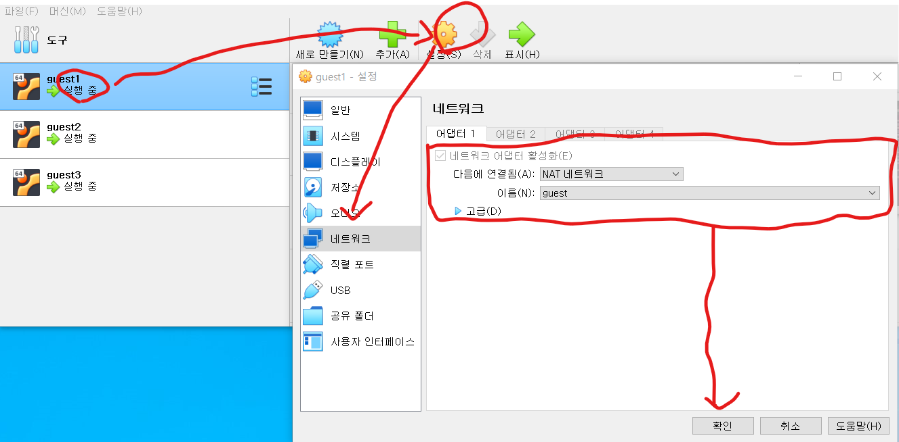

---
### 단계9: config 생성 및 작성 
- git bash 접속 및 아래 스크립트 실행 
```shell
# .ssh 생성
mkdir ~/.ssh

# config 파일 생성
vim ~/.ssh/config

# 위에서 작성한 NAT 네트워크 참고 해서 작성 
Host guest1
        HostName 192.168.56.1 # host ip 작성
        Port 2201 # NAT 네트워크 참고
        User root 
Host guest2
        HostName 192.168.56.1 # host ip 작성
        Port 2202 # NAT 네트워크 참고
        User root
Host guest3
        HostName 192.168.56.1 # host ip 작성
        Port 2203 # NAT 네트워크 참고
        User root

# 저장된 내용 확인 
cat ~/.ssh/config
```

---
### 단계10: (테스트) host에서 모든 guest에 접속 테스트
- 모든 guest 인스턴스 시작하기 

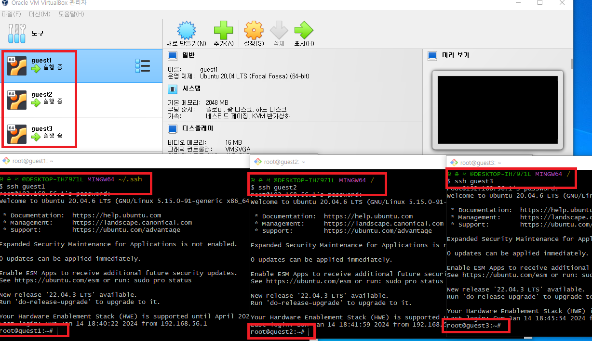

---
### 단계11: 모든 guest > hosts 파일 수정
- guest ip 추가하기 
```shell
vim /etc/hosts

# 각자 자신의 guest ip addr 작성 
10.0.2.4 guest1
10.0.2.5 guest2
10.0.2.15 guest3

# 확인 
tail /etc/hosts
```

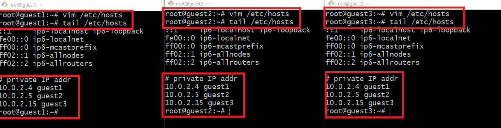

---
### 단계12: 모든 guest >  ssh-keygen 생성
```shell
ssh-keygen # enter 3번
cd ~/.ssh
ls
```
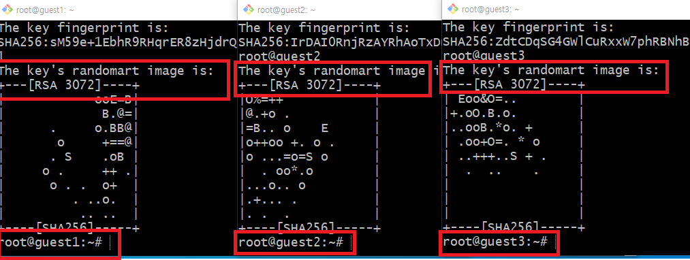

---
### 단계13: 모든 guest > ssh public key 교환 작업
```shell
ssh-copy-id root@guest1
ssh-copy-id root@guest2
ssh-copy-id root@guest3
```
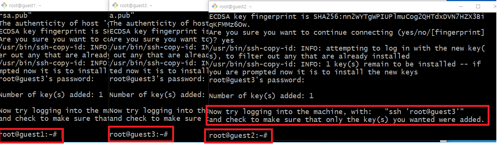

---
### 단계14: (테스트) 모든 guest > guest간 접속 테스트
```shell
ssh guest1
ssh guest2
ssh guest3
```
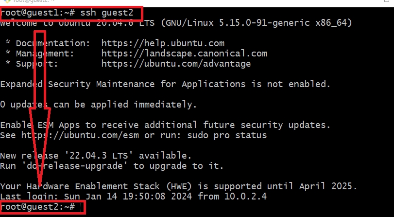


