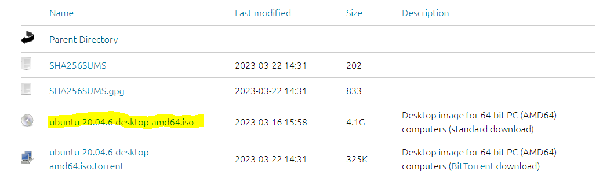
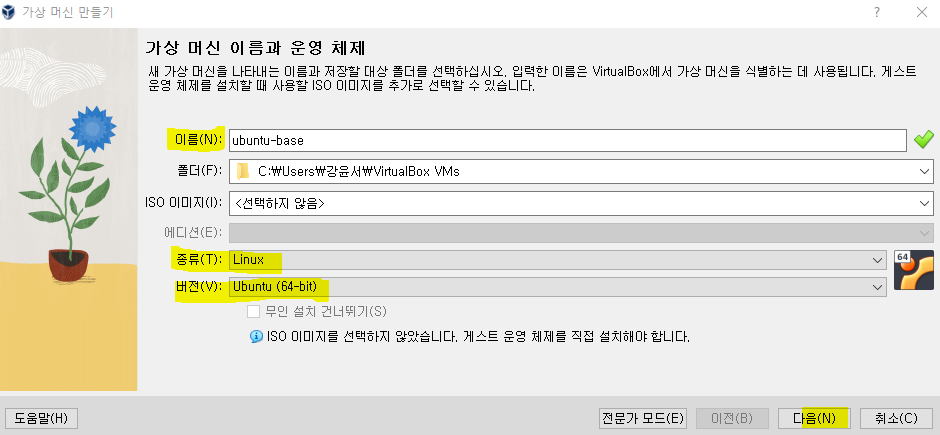
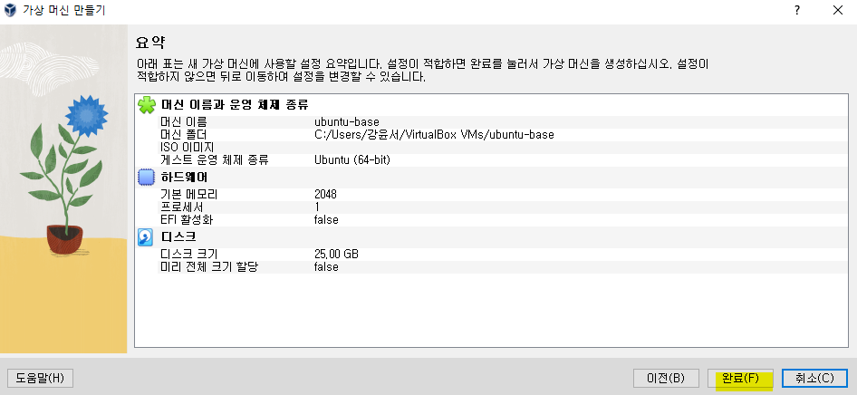
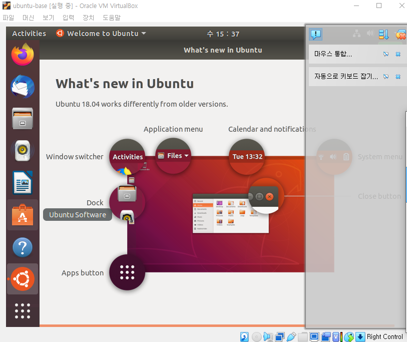

# ubuntu 생성 예제 
### 단계1: [이미지 다운로드](https://releases.ubuntu.com/focal/)

---
### 단계2: 새로 만들기 

---
### 단계3: 가상 머신 이름과 운영 체제  

---
### 단계4: 하드웨어 
- 메모리와 프로세서 설정  

---
### 단계5: 가상 하드 디스크 

---
### 단계6: 만들기

---
### 단계7: 시작하기  

---
### 단계8: 다운로드한 우분투 이미지 추가  

---
### 단계9: install ubuntu
- continue-continue-install now-continue-continue 

---
### 단계10: 유저 생성 및 restart

---
### 단계11: 우분투 접속 

