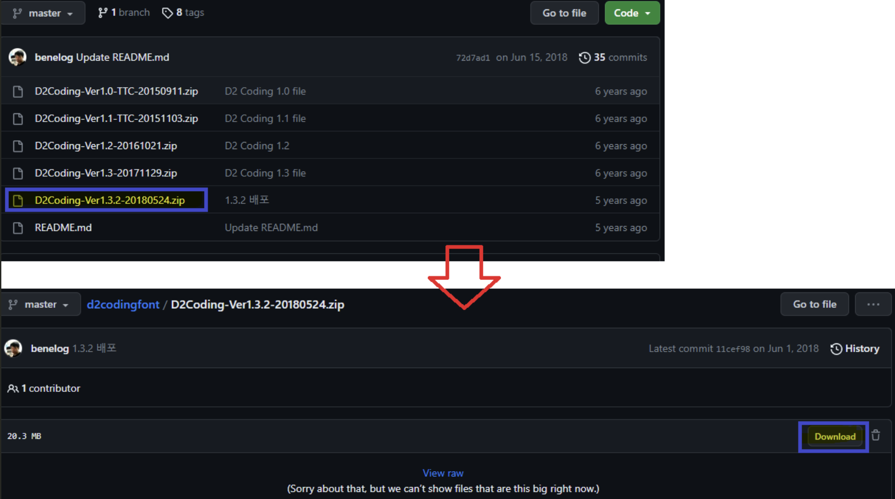
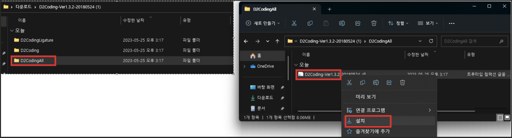
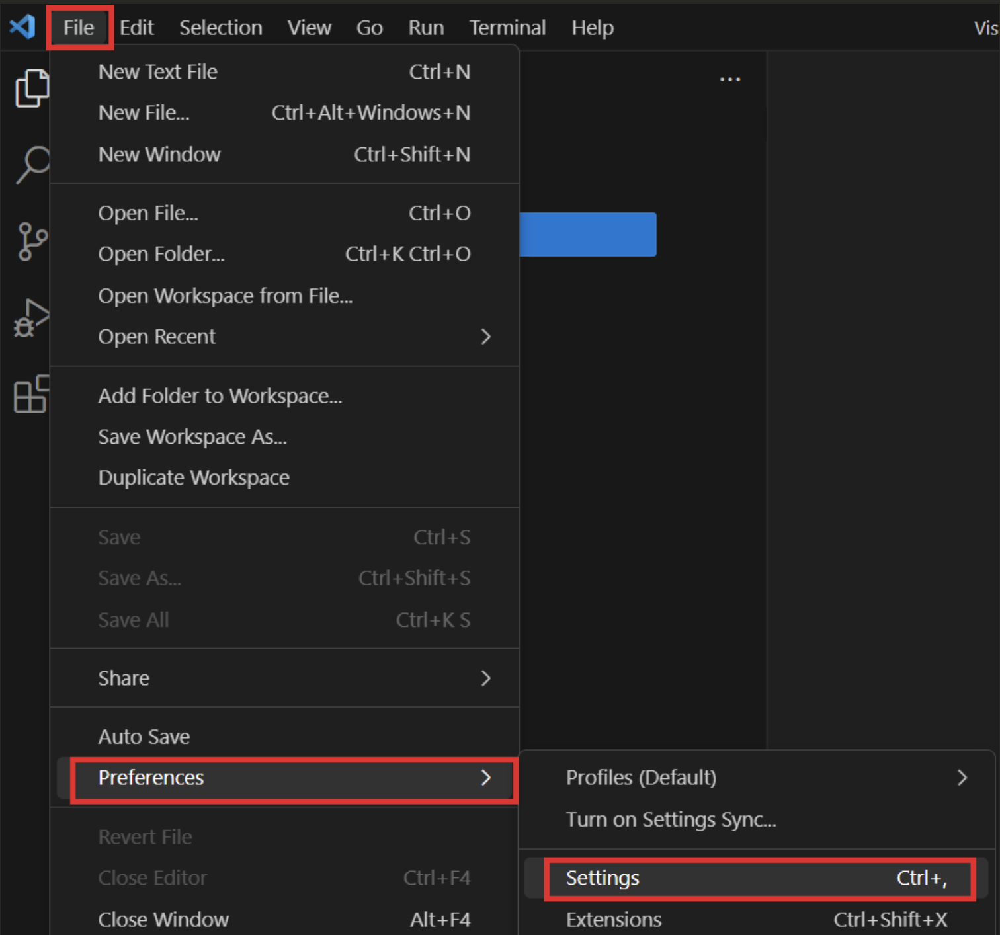
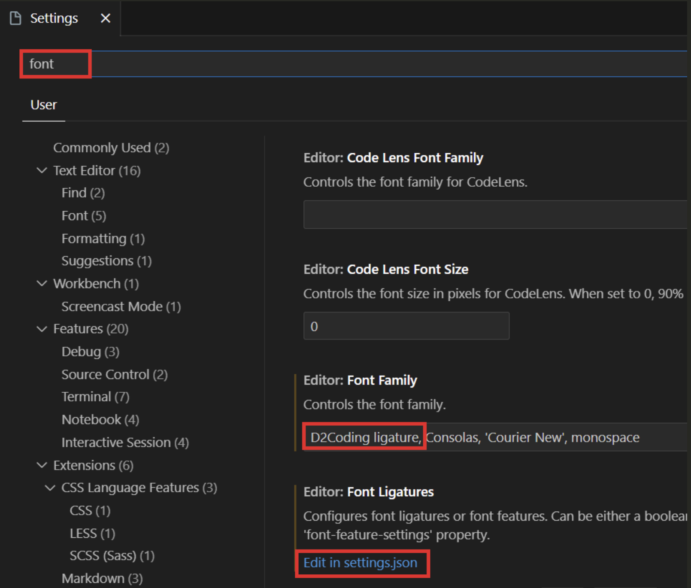
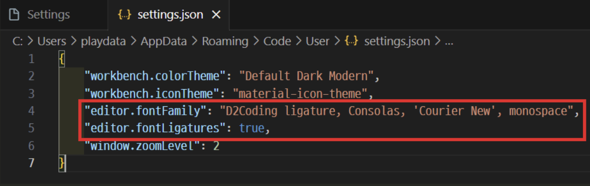
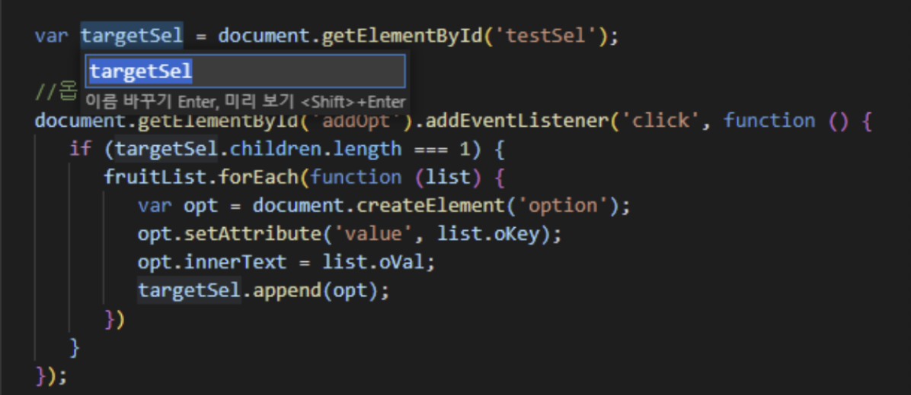
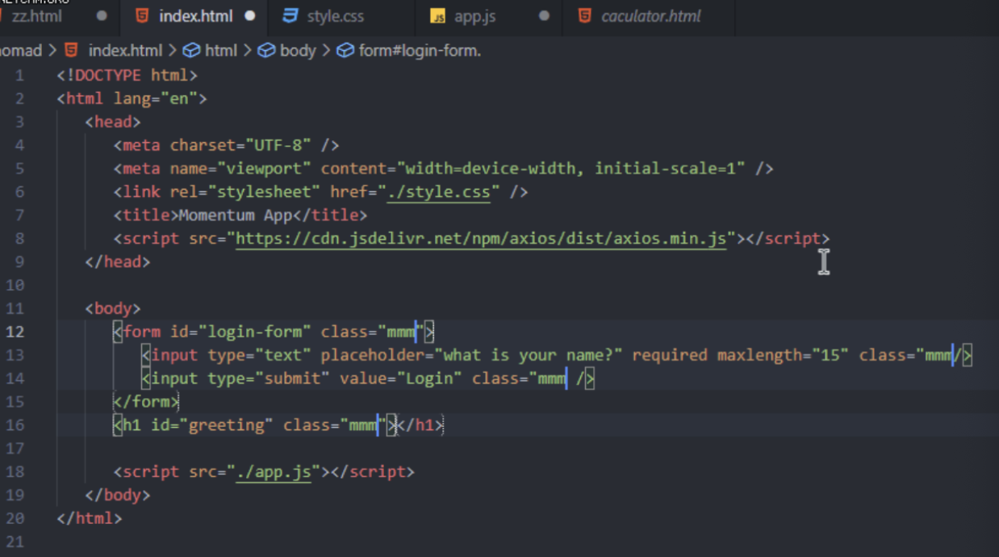
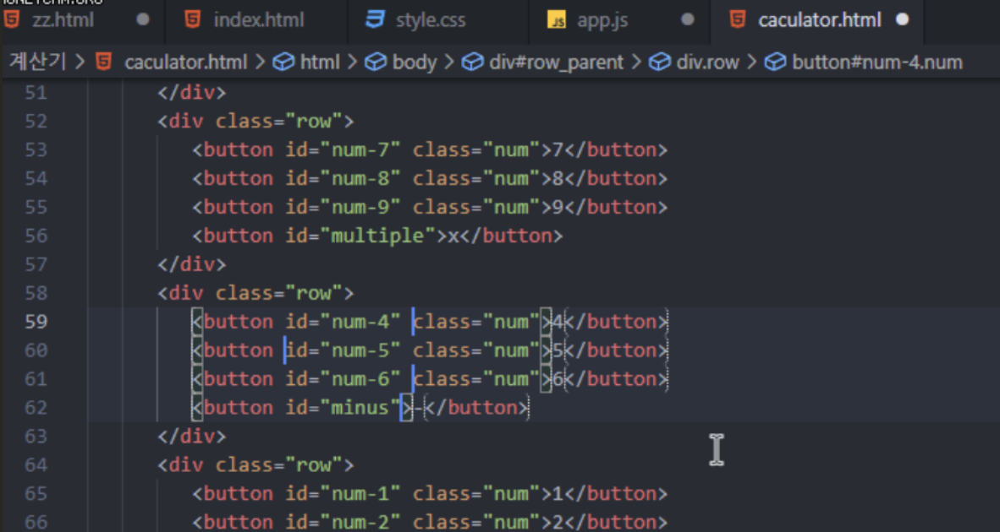
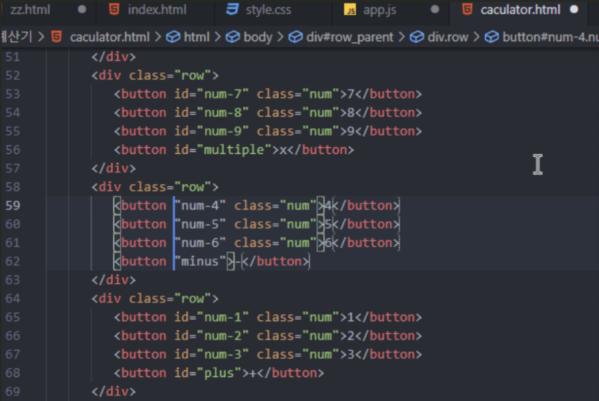

# 윈도우 설정

## [vscode powershell 사용권한 추가](https://velog.io/@khakhid/VSCode-%ED%84%B0%EB%AF%B8%EB%84%90-Powershell-%EC%8B%A4%ED%96%89-%EC%A0%95%EC%B1%85-%EA%B6%8C%ED%95%9C-%EB%B3%80%EA%B2%BD%ED%95%98%EA%B8%B0)
1. 윈도우 Powershell을 관리자 권한으로 실행
2. `get-ExecutionPolicy` 명령어로 권한을 확인
  - 'Restricted' 상태일 가능성이 높음
3. `Set-ExecutionPolicy RemoteSigned` 명령어 실행

---
### 권한 상태 종류
  - Restricted : default 값, 스크립트 파일을 실행할 수 없다.
  - AllSinged : 신뢰 가능한(서명된) 스크립트 파일만 실행할 수 있다.
  - RemoteSigned : 로컬 생성 스크립트, 서명된 스크립트 파일을 실행할 수 있다.
  - Unrestricted : 모든 스크립트를 실행할 수 있다.
  - ByPass : 경고/차단 없이 모든 것을 실행할 수 있다.
  - Undefined : 권한 설정을 하지 않는다.

---
# [개발폰트 설치](https://ux.stories.pe.kr/177) 
### 1단계: [D2 Coding 글꼴 다운로드](https://github.com/naver/d2codingfont)

---
### 2단계: D2 Coding 글꼴 설치

---
### 3단계: D2 Coding 글꼴 적용

---
`D2Coding ligature`

---
# [자주 사용하는 단축키](https://inpa.tistory.com/entry/VS-Code-%E2%8F%B1%EF%B8%8F-%EC%9C%A0%EC%9A%A9%ED%95%9C-%EB%8B%A8%EC%B6%95%ED%82%A4-%EC%A0%95%EB%A6%AC#f2__ctrl_+_h_%EB%88%8C%EB%9F%AC%EC%84%9C_%EB%AA%A8%EB%93%A0_%EB%8B%A8%EC%96%B4_%EB%B0%94%EA%BE%B8%EB%8A%94_%EA%B8%B0%EB%8A%A5%EC%9D%84_%ED%95%9C%EB%B2%88%EC%97%90_%EA%B0%80%EB%8A%A5)

## 에디터 단축키 
- `Ctrl + b`:     
왼쪽 탐색기 창 끄기/켜기
- `Ctrl + '+' / '-'`:    
폰트 사이즈 조절 
- `Ctrl + \`:    
현재 파일을 두 개의 세로 분할 패널로 나눠줌 
  - `Ctrl + 1 / 2`:    
  분할 패널에서의 포커스 이동(1:왼쪽, 2:오른쪽)   

---
## 코딩 단축키 
- F2:    
다른 참조파일도 자동으로 다 바꿔줌 

---
- Ctrl + Shift + L:     
같은 단어 전체 선택 

---
- Alt + Click:    
멀티 커서 

---
- Ctrl + Alt + (↑, ↓):     
길다란 커서 

