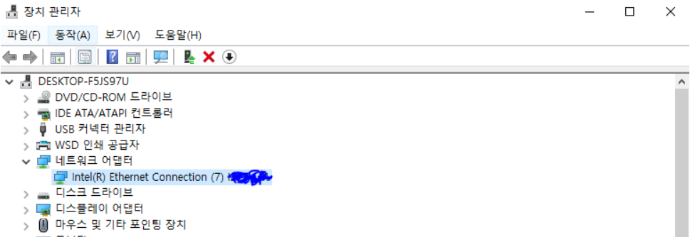
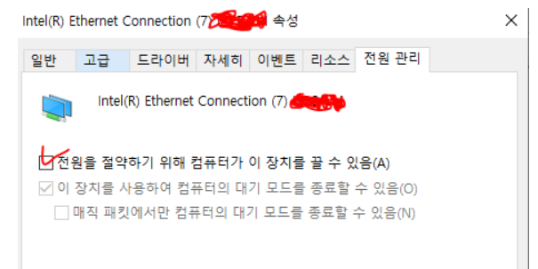

### 단계1: [다운로드](https://www.netsarang.com/ko/free-for-home-school/)

---
### 단계2: 설치 

---
### 단계3: [에러해결 : xshell Socket error Event: 32 Error: 10053.](https://bart-2012.tistory.com/33)
- xshell 을 써서 서버와 연결하여 사용하던중 때때로 아래와 같은 에러로인해 연결이 끊긴다.
  - Socket error Event: 32 Error: 10053.
- 이는 컴퓨터에서 일정시간 사용을 하지 않을경우 전원 관리를 위해 네트워크 연결을 끊기 때문이다.
- `전원을 절약하기 위해 컴퓨터가 이 장치를 끌 수 있음`을 이용하여 해결하자

---

---

