# [네트워크란?](https://www.devkuma.com/docs/network/overview/)
- 네트워크란 그물을 뜻하는 Net과 Work의 합성어로, 그물처럼 서로 긴밀하게 연결되어 있는 것을 뜻합니다. 
- 보통 IT에서 사용되는 정의로 보자면 두 대 이상의 컴퓨터들을 연결하고 서로 통신할 수 있는 것을 말합니다. 

다음장에는 택배 우편과 인터넷 통신을 비교한 내용입니다.

---
### 택배 우편의 흐름
1. 우선은 “송신처 주소"와 가까운 영업소에 모인다. (위 그림에서는 서울 영업소)
2. 다음은 “수신처 주소"를 보고, 수신처 주소에 가까운 영업소에 보낸다. (위 그림에서는 부산 영업소)
3. 마지막으로 영업소에서 “수신처 주소"에 도착하게 된다.

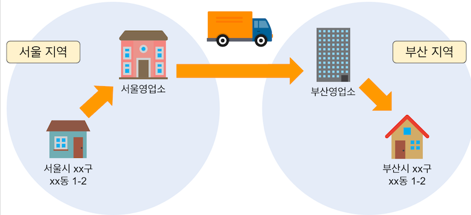

---
### 인터넷에서 데이터를 송수신하는 흐름
1. 우선 “송신처 IP 주소"에 가까운 라우터라고 불리는 네트워크 기기(택배 영업소와 같은 역할)에 데이터를 송신한다.
2. 그런 다음 라우터는 “대상 IP 주소"를 보고 “대상 IP 주소"에 가까운 라우터로 보낸다.
3. 마지막으로 라우터로부터 “송신처 IP 주소"가 부여되어 있는 컴퓨터(네트워크 기기)에 전달한다.

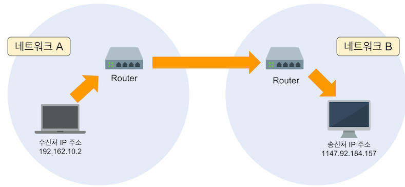

---
# [IP (Internet Protocol)](https://www.devkuma.com/docs/ip-address/)
- IP란? 
인터넷에서 데이터 전달 프로토콜
- IP 주소란?
IP 주소는 인터넷상의 컴퓨터 주소이다. 인터넷에 연결되어 있는 기기에는 반드시 IP 주소가 부여된다.

### 공인 IP와 사설 IP 차이
- IP 주소에는 “사설 IP 주소(Private IP Address)“와 “공인 IP 주소(Public IP Address)“가 있다.
- 공인 IP 주소는 인터넷에 연결하는 데 필요한 IP 주소이고, 사설 IP 주소는 가정 및 회사와 같은 조직 내의 네트워크(개인 네트워크)에서만 사용되는 IP 주소이다.

---

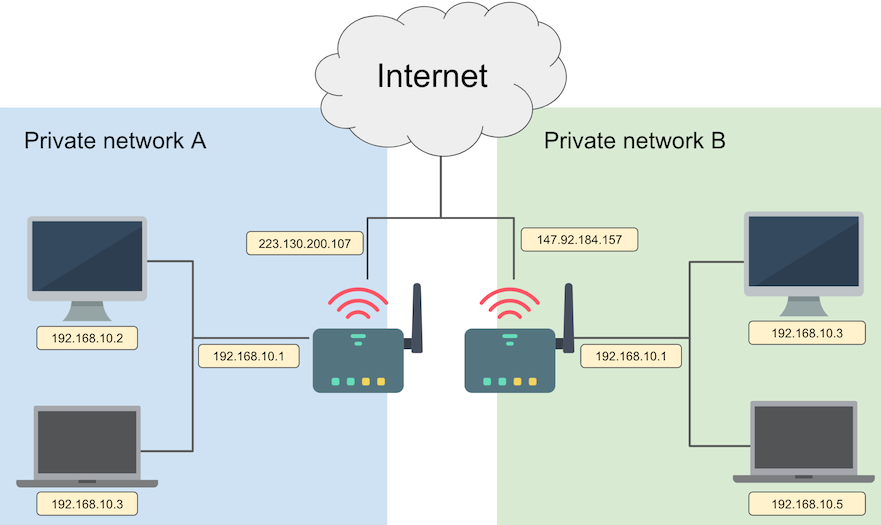

---
#### 공인 IP
- 전세계에서 유일한 IP로 ISP(인터넷 서비스 공급자)가 제송하는 IP주소이다.
- 외부에 공개되어 있기 때문에 인터넷에 연결된 다른 장비로부터 접근이 가능하다.
- 그에 따라 방화벽 등과 같은 보안 설정을 해주어야 한다.
#### 공인 IP 대역 

---
#### 사설 IP
- 어떤 네트워크 안에서 사용되는 IP주소이다.
- IPV4의 부족으로 인해 모든 네트워크가 공인 IP를 사용하는 것이 불가능하기 때문에 네트워크 안에 라우터를 통해 할당받는 가상의 주소이다.
- 별도의 설정 없이 외부에서 접근이 불가능하다. 
#### 사설 IP 대역 
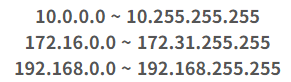

---
## IP 주소 정의
### 클래스 풀(classful) 방식
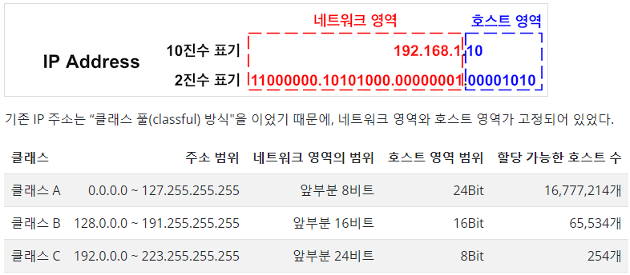
예를 들면, 100대의 IP 주소가 필요한 기업이 “클래스 C"를 사용했을 경우, 클래스 C에서 할당 가능한 호스트 수가 254개에서 필요한 IP 주소 100대를 제외하면 154개의 IP 주소가 낭비(254 - 100 = 154)가 발생하게 된다.

---
### 클래스리스(Classless) 방식
- 클래스 풀(classful) 방식의 단점을 보완한 방식이다.
- 클래스리스 방식이란, 서브넷 마스크 를 사용해 네트워크 영역"와 “호스트 영역"의 경계를 자유롭게 변경하는 것을 가능 하게 한 방식이다.
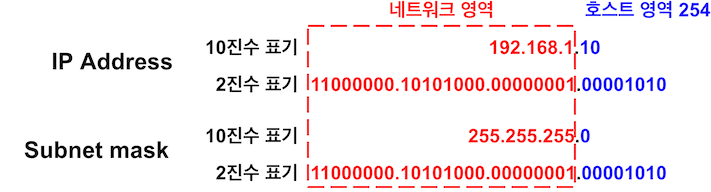

---
그럼 “네트워크 영역"와 “호스트 영역"의 경계를 오른쪽으로 1개 옮겨 본다.

그러면 서브넷 마스크가 “255.255.255.0"에서 “255.255.255.128"로 바뀐다. 이 경우 컴퓨터에 사용할 수 있는 IP 주소는 126개(192.168.1.1 ~ 192.168.1.126)이다.
그 결과 26개(126 - 100 = 26)의 IP 주소만 낭비된다. (예비용이라고 생각하면 낭비는 아니다)
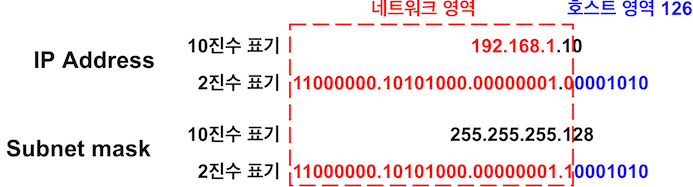

---
# [포트(Port)](https://ittrue.tistory.com/185)
- 포트는 “논리적인 접속장소”를 뜻하며, 
- 인터넷 프로토콜인 TCP/IP를 사용할 때 클라이언트 프로그램이 네트워크 상의 특정 서버 프로그램을 지정하는 방법으로 사용한다.
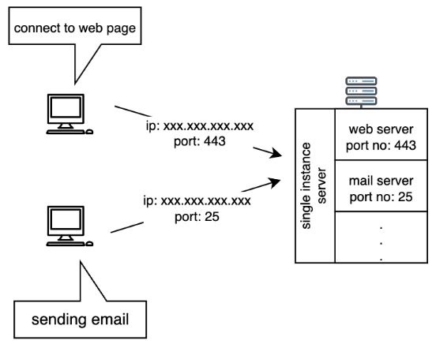

---
### 포트 번호
- 포트 번호는 0 ~ 65,535까지 사용할 수 있다. 
- 이 중에서 0 ~ 1023번 까지의 포트 번호는 주요 통신을 위한 규약에 따라 이미 정해져 있는 포트이다.
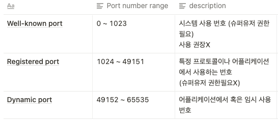

---
### 자주 사용되는 포트 번호 
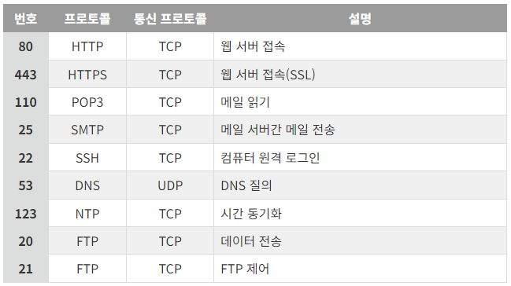

---
# [포트포워딩](https://lamanus.kr/59)
포트포워딩(port forwarding)은 컴퓨터 네트워크 상에서 패킷이 방화벽이나 라우터 같은 네트워크 게이트를 지날 때 IP 주소와 포트 번호 결합의 통신 요청을 다른 곳으로 넘겨주는 네트워크 주소 변환의 응용이라고 볼 수 있습니다.

---
- 외부 포트와 내부 포트는 서로 다를 수 있습니다.
(80을 8080으로 포워딩 가능)
- 내부에서 연결하려는 포트는 아이피를 반드시 지정해야 합니다.
- 하나의 포트로 들어오는 연결을 두 아이피로 포워딩 할 수 없습니다.
(하나의 포트는 하나의 포워딩만 가능)
- 공유기가 할당한 아이피에만 포워딩이 가능합니다.
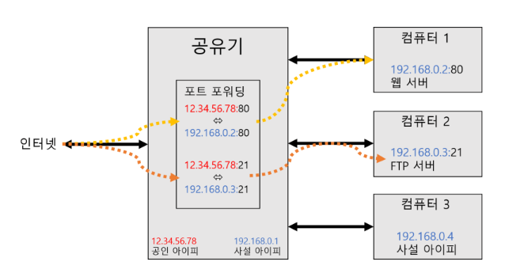

---
# 그외 주요 개념들
- [VPN](https://www.devkuma.com/docs/vpn/)
- [OSI 7 계층](https://www.devkuma.com/docs/osi7-layer/)
- [TCP/UDP](https://www.devkuma.com/docs/tcp-udp/)
- [TCP/IP](https://www.devkuma.com/docs/tcp-ip/)
- [DNS](https://www.devkuma.com/docs/dns/)
- [CDN](https://www.devkuma.com/docs/cdn/)
- [Proxy](https://www.devkuma.com/docs/proxy/)
- [Forward & Redirect](https://www.devkuma.com/docs/forward-and-redirect/)
- [Load Balancer](https://www.devkuma.com/docs/load-balancer/)
